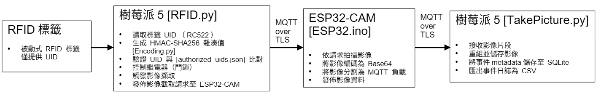

# RFID 門禁安全系統
### （Raspberry Pi 5 + ESP32-CAM，安全 IoT 整合）

**核心重點：** 安全的裝置整合、硬體感知設計、真實 IoT 系統取捨

---

## 專案概述

此專案實作了一個 **安全的多裝置 RFID 門禁控制系統**：

- Raspberry Pi 5 作為 **中央控制器**（驗證、邏輯、繼電器控制、紀錄）
- ESP32-CAM 作為 **專用邊緣影像節點**
- **支援 TLS 的 MQTT** 用於安全的裝置間通訊
- 以硬體觸發的 **感知 → 決策 → 動作** 工作流程

> 目標並非 UI 炫麗的展示，而是一個 **可部署的 IoT 系統**，突顯  
> 安全設計、硬體限制與工程取捨。

---
## 此專案解決了什麼問題？
此專案明確解決：
- 單一裝置負擔過多混合職責，使用**分散式職責**，跨異質裝置
- **硬體感知 GPIO 設計**（Raspberry Pi 5 RP1 I/O 架構）
- **可靠加密通訊**，確保邊緣裝置間安全互動

---

## 主要工程決策與發現

### 安全設計的 RFID 驗證
- RFID UID 不以明文儲存或傳輸
- UID 驗證透過 **HMAC-SHA256**
- 授權清單僅包含 **雜湊值**

### 分散式邊緣架構
- Raspberry Pi 5：控制邏輯、驗證、繼電器、紀錄
- ESP32-CAM：僅負責影像截取、分片與傳輸
- 避免資源競爭，簡化系統推理

### Raspberry Pi 5 GPIO 現實（RP1 I/O）
- 繼電器控制使用 **RP1 原生 GPIO (`lgpio`)**
- RC522 Python 生態系仍依賴 **舊版 RPi.GPIO**
- 專案採用 **混合 GPIO 後端**，作為明確的工程折衷

**結論：**
> 實用的 IoT 系統往往需要 **混合解決方案**，在安全性、生態成熟度與硬體限制間取得平衡。

---

## Demo
**RFID 驗證 → 繼電器解鎖 → ESP32-CAM 拍照 → 安全 MQTT 傳輸**

示範影片：  
https://youtu.be/tfpOGa3I91k

系統架構：



---

**詳細設計、實作與安全說明如下**

---
---

## 1. 系統架構

**資料流程：**

RFID 標籤  
→ Raspberry Pi 5（RFID 驗證與決策邏輯）  
→ ESP32-CAM（影像截取）  
→ Raspberry Pi 5（安全接收與紀錄）

此架構強制 **裝置間職責清晰分工**。

---

## 2. 硬體職責

### Raspberry Pi 5
- RC522 RFID 讀取器
- UID 驗證（HMAC-SHA256）
- 繼電器（門鎖）控制
- 拍照觸發
- MQTT TLS 客戶端
- SQLite 事件紀錄
- 自動 CSV 匯出供稽核

### ESP32-CAM
- 相機擷取
- Base64 編碼
- 透過 MQTT 分段影像傳輸

---

## 3. 安全通訊與資料處理

- MQTT 搭配 **雙向 TLS 驗證**
- 不以明文儲存敏感識別碼
- 私鑰與密鑰不納入版本控制

### UID 處理策略

- `authorized_uids.json` 僅儲存 **雜湊值**
- 明文 UID 僅在離線時使用一次，用於產生雜湊
- 執行期間不保留 UID

---

## 4. Raspberry Pi 5 GPIO 架構

此專案運行於 **Raspberry Pi 5（RP1 I/O 架構）**。

- 繼電器控制：`lgpio`（RP1 原生）
- RC522 RFID：既有 Python 函式庫（`mfrc522`, `pi-rc522`）
  - 目前仍依賴 **舊版 RPi.GPIO 後端**

**工程取捨：**
- 採用混合 GPIO 後端
- 反映現有生態限制

---

## 5. 軟體堆疊

- Python 3
- Mosquitto MQTT Broker
- paho-mqtt
- SQLite

---

## 6. 啟動流程

1. 啟動 Mosquitto MQTT broker  
2. 開機 ESP32-CAM  
3. 在 Raspberry Pi 5 上執行：

```bash
python RFID.py
```
## 7. 檔案目錄結構

```text
RFID_door_security/
├── docs/
│   ├── wiring.md
|   ├── requirements.txt
│   ├── system_arch.png
│   └── system_architecture.png
│
├── ESP32/
|   ├── ESP32.ino            # 拍照 + MQTT 傳輸
|   └── Burn.ino             # TLS 憑證寫入 SPIFFS
|
├── Log/
│   └── rfid_log_daily.csv.png          # 每日自動匯出 CSV 之截圖
│
├── photos/
|   ├── photo_20251230_081852.jpg  # 拍攝的照片＃１
|   ├── photo_20251230_081908.jpg  # 拍攝的照片＃２
|   └── photo_20251230_081922.jpg  # 拍攝的照片＃３
|
├── Raspberry_pi/
│   ├── RFID.py                     # 讀卡 → 比對 → 開門 → 呼叫拍照
│   ├── TakePicture.py              # MQTT TLS 收圖 + 儲存 + SQLite + CSV
│   ├── Encoding.py                 # HMAC-SHA256 UID → 建立授權檔
│   └── authorized_uids.json        # 已授權的 UID (HMAC)
│
└── README.md
```
## License Notice

The source code in this repository is released under the MIT License.

Demo materials, including videos, photos, logs, and generated data under the following directories are provided for demonstration purposes only and are NOT covered by the MIT License:

- photos/
- Log/

These materials may not be redistributed or reused without explicit permission.
